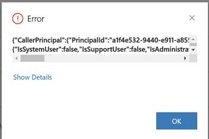

---

title: eiuryeiwr  
description: Description  
solution: Target  
product: Target  
applies-to: "Target"  
keywords: KCS  
resolution: Resolution  
internal-notes:   
bug: False  
article-created-by: Mohini lakshmi priya Mothukuri  
article-created-date: "10/16/2020 9:50:49 AM"  
article-published-by: Mohini lakshmi priya Mothukuri  
article-published-date: "10/16/2020 9:51:30 AM"  
version-number: 1  
article-number: KA-14587  
dynamics-url: "https://adobe-sbx22.crm.dynamics.com/main.aspx?forceUCI=1&pagetype=entityrecord&etn=knowledgearticle&id=fc248311-950f-eb11-a813-000d3a98f7e7"

---

# eiuryeiwr

## Description

test azure image

iframe

>[!VIDEO](https://video.tv.adobe.com/v/18696?quality=9&learn=on)

sharepoint

video

 >[!VIDEO](https://video.tv.adobe.com/v/18696?quality=9&learn=on)  

iframe

>[!VIDEO](https://video.tv.adobe.com/v/18696?quality=9&learn=on)

azure

## Resolution

test
