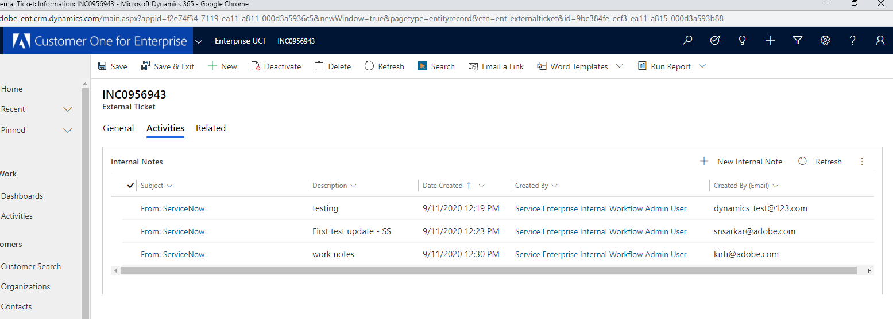

---

title: test final
description: Description
solution: Analytics
product: Analytics
applies-to: "Analytics"
keywords: KCS
resolution: Resolution
internal-notes:
bug: False
article-created-by: Mohini lakshmi priya Mothukuri
article-created-date: "10/16/2020 9:31:35 AM"
article-published-by: Mohini lakshmi priya Mothukuri
article-published-date: "10/16/2020 9:32:10 AM"
version-number: 1
article-number: KA-14586
dynamics-url: "https://adobe-sbx22.crm.dynamics.com/main.aspx?forceUCI=1&pagetype=entityrecord&etn=knowledgearticle&id=63973860-920f-eb11-a813-000d3a98f7e7"

---

# test final

## Description

test azure image

iframe

>[!VIDEO](https://video.tv.adobe.com/v/18696?quality=9&learn=on)

sharepoint

video

>[!VIDEO](https://video.tv.adobe.com/v/18696?quality=9&learn=on) 

iframe

>[!VIDEO](https://video.tv.adobe.com/v/18696?quality=9&learn=on)

azure

## Resolution

test
