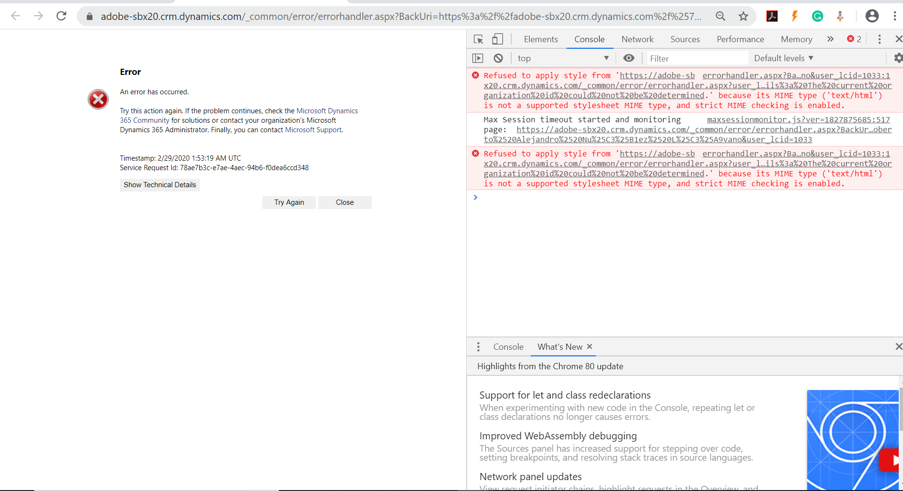

---

title: "Article with all images"  
description: Description  
solution: Target  
product: Target  
applies-to: "Target"  
keywords: "KCS"  
resolution: Resolution  
internal-notes:   
bug: False  
article-created-by: KCS_Coach Generic  
article-created-date: "11/2/2020 9:44:33 AM"  
article-published-by: KCS_Coach Generic  
article-published-date: "11/2/2020 9:49:07 AM"  
version-number: 1  
article-number: KA-32560  
dynamics-url: "https://adobe-estg.crm.dynamics.com/main.aspx?forceUCI=1&pagetype=entityrecord&etn=knowledgearticle&id=288a8bff-ef1c-eb11-a814-000d3a35ed4e"

---

# Article with all images

## Description

d365 sharepoint:

azure:

zendesk:

public:

pk2 sharepoint:

## Resolution

test
